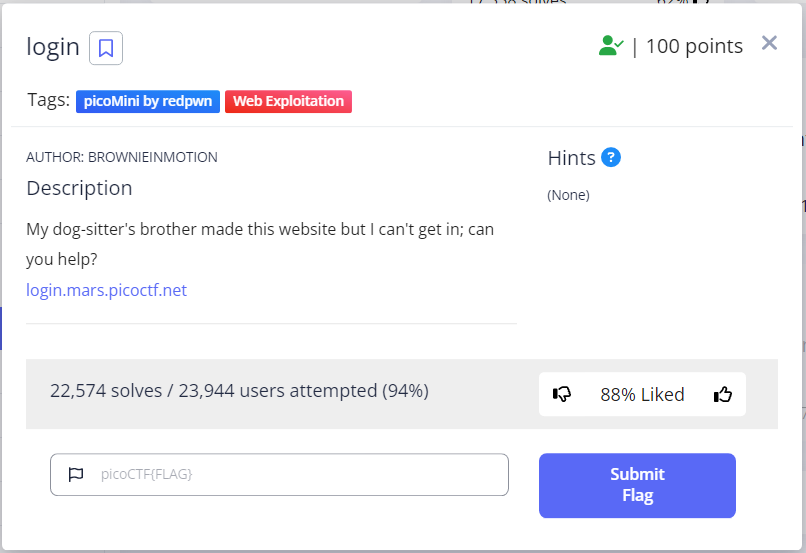
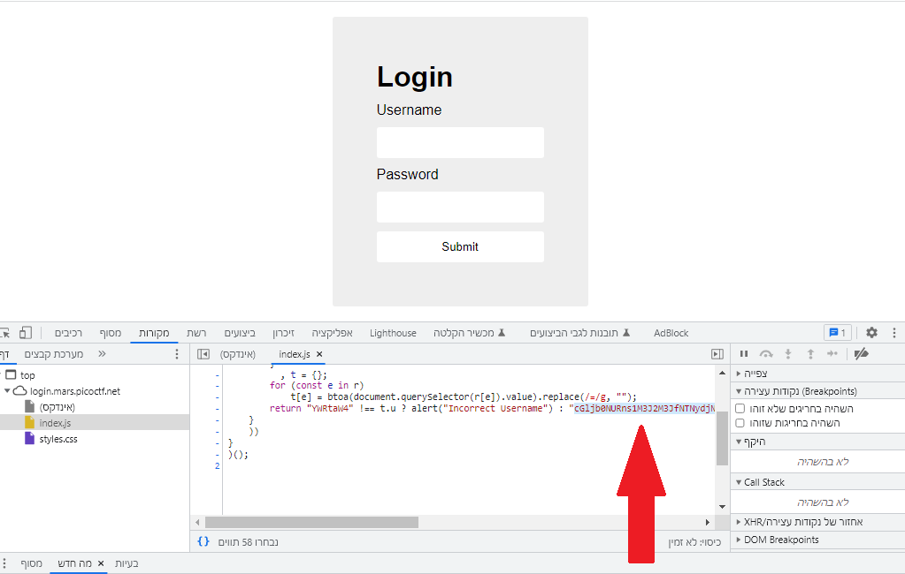

# login
This is the write-up for the challenge "login" challenge in PicoCTF

# The challenge
"login" 

# Description
Find the flag being held on this server to get ahead of the competition https://login.mars.picoctf.net/

picture of finish it:

# Hints
0

# Initial look
a login page with username and password fiels

# How to solve it
go to the index.js file by right click and than sources than we be able to see the index.js file open it and in the return 
we can see that the code is checking if the username and password provided by the user match a predetermined value.

here is how:

The code is using the !== operator to compare two values:

The first comparison is checking if the value of t.u (presumably the username entered by the user) is not equal to the string "YWRtaW4".
If the username is not correct, the code will display an alert message saying "Incorrect Username".
If the username is correct, the code moves on to the second comparison, which is checking if the value of t.p (presumably the password entered by the user) is not equal to the string "cGljb0NURns1M3J2M3JfNTNydjNyXzUzcnYzcl81M3J2M3JfNTNydjNyfQ".
If the password is not correct, the code will display an alert message saying "Incorrect Password".
If both the username and password are correct, the code will display an alert message saying "Correct Password! Your flag is" followed by the decoded value of t.p using the atob() function. This suggests that the string "cGljb0NURns1M3J2M3JfNTNydjNyXzUzcnYzcl81M3J2M3JfNTNydjNyfQ" is actually a base64-encoded string that represents the flag.

This string "cGljb0NURns1M3J2M3JfNTNydjNyXzUzcnYzcl81M3J2M3JfNTNydjNyfQ" is actually our answer, but it's in base 64, I googled the structure of strings in different bases and realized that it was base 64
i use some website to decode it.
i used this site : https://www.base64decode.org/

The flag is picoCTF{53rv3r_53rv3r_53rv3r_53rv3r_53rv3r}

And that's it, I'm done  😄
